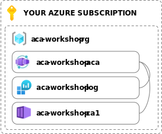
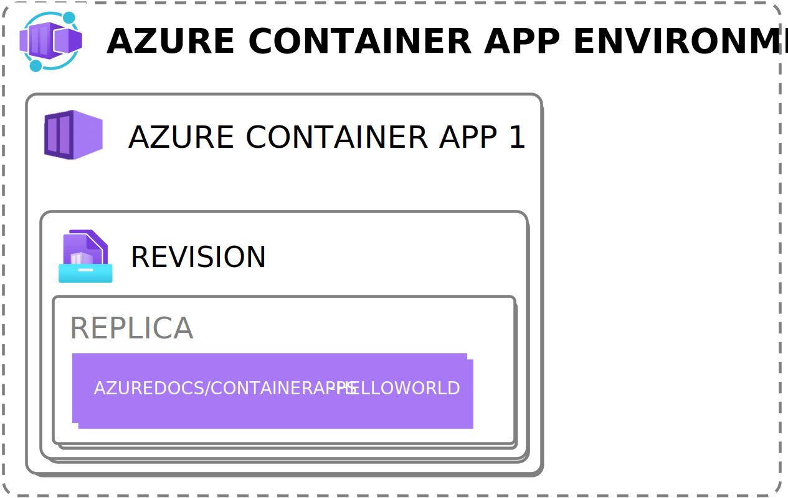

# Lab 1: My first container app

In this lab we'll create a container app in the simplest way possible so you get the chance to explore the possibilities of Azure Container Apps.

> This lab is a very basic introduction of a Azure Container app running 1 container. If you've already seen something of Azure Container apps, skip to Lab 2 to deploy an actual app with 3 containers using Infrastructure as code.

## 1. Creating a Azure Container App Environment + requirements

TODO

## 2. Explore the created Azure Container App
TODO

