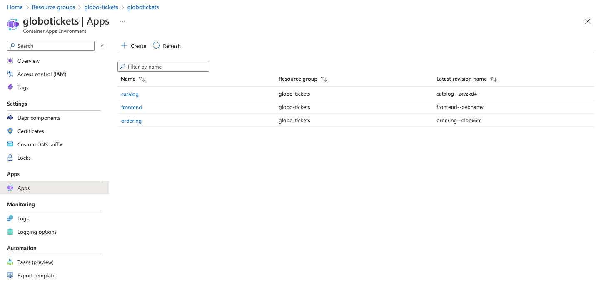
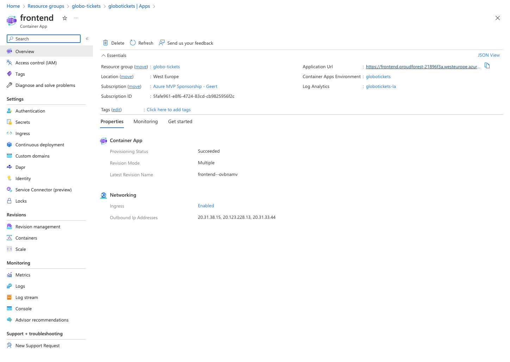

# Lab 2: Deploying an Azure Container App using Infrastructure as code

## 1. Learning about Globo Tickets
In this lab we'll take a look at an application called Globo Tickets. It's an application that consists of 3 services working together. First of all there is a front end  from their URLs serving a web shop as a website. This front end  from their URLs uses the catalog  from their URLs to retrieve the items & prices to populate the webshop. After that whenever an order is placed this is sent to an ordering  from their URLs which will handle further processing of this order.


### 1.1. Running Globo Tickets Locally
To get a good feeling of the application you can run the application locally before we actually deploy it in the cloud. We can do this by using `Docker Compose`.
There is a Docker Compose file (`docker-compose.yml`) in the `src/globo-tickets-basic` directory that you could use to run the app locally. 

> Installing Docker Compose: If you have Docker Desktop installed you already have Docker Compose ready to use. If not you can install the compose plugin next to Docker here: https://docs.docker.com/compose/install/

> Tip for running Docker Compose:
> - [`Docker Compose Build`](https://docs.docker.com/engine/reference/commandline/compose_build/)
> - [`Docker Compose Up`](https://docs.docker.com/engine/reference/commandline/compose_up/)

## 2. Deploying Gobo Tickets to Azure Container Apps

### 2.1 Required infrastructure
In [Lab 1 - My first container app](labs/first-container-app.md) we've seen all the requirements we need to create an Azure Container App Environment. Before we can deploy our application we need to create a:

- Azure Log Analytics Workspace
- Azure Container App Environment
- (optional) Application Insights

Since we're not cavemen/women we will create these resources using Infrastructure as Code. You are free to choose your own language if you dare but in this lab we'll describe how to do this through Azure CLI or using Bicep.

> If you are up for the challenge of doing this through Pulumi or Terraform be our guest! we would love ❤️ to see what you did so we can integrate it into these labs to make it better. PRs welcome ;) 

### 2.1.1 Deploying Globo Tickets required infrastructure  using Azure CLI
To create the required resources through CLI you can take a look at the following az cli commands:

- [`az monitor log-analytics workspace create`](https://learn.microsoft.com/nl-nl/cli/azure/monitor/log-analytics/workspace?view=azure-cli-latest#az-monitor-log-analytics-workspace-create)
- [`az containerapp env create`](https://learn.microsoft.com/nl-nl/cli/azure/containerapp/env?view=azure-cli-latest#az-containerapp-env-create)
- [`az monitor app-insights component create`](https://learn.microsoft.com/nl-nl/cli/azure/monitor/app-insights/component?view=azure-cli-latest#az-monitor-app-insights-component-create)

Add them in a script file so you can run this automation more often (for example from a pipeline).

### 2.1.2 Deploying Globo Tickets required infrastructure using Bicep

To create the app environment + additional resources you could use the following piece of bicep to create a re-usable module.
> note that we create an output parameter with the Id of the Azure Container App Environment to be used later in other modules.

```Bicep
param environmentName string = 'globotickets'
param logAnalyticsWorkspaceName string = 'globotickets'
param appInsightsName string = 'globotickets'
param location string = resourceGroup().location

resource logAnalyticsWorkspace 'Microsoft.OperationalInsights/workspaces@2020-03-01-preview' = {
  name: logAnalyticsWorkspaceName
  location: location
  properties: any({
    retentionInDays: 30
    features: {
      searchVersion: 1
    }
    sku: {
      name: 'PerGB2018'
    }
  })
}

resource appInsights 'Microsoft.Insights/components@2020-02-02' = {
  name: appInsightsName
  location: location
  kind: 'web'
  properties: {
    Application_Type: 'web'
    WorkspaceResourceId:logAnalyticsWorkspace.id
  }
}

resource environment 'Microsoft.App/managedEnvironments@2022-03-01' = {
  name: environmentName
  location: location
  properties: {
    daprAIInstrumentationKey:appInsights.properties.InstrumentationKey
    appLogsConfiguration: {
      destination: 'log-analytics'
      logAnalyticsConfiguration: {
        customerId: logAnalyticsWorkspace.properties.customerId
        sharedKey: logAnalyticsWorkspace.listKeys().primarySharedKey
      }
    }
    //vnet config
  }
}

output environmentId string = environment.id

```

> In this example we're not adding a connection to an existing vnet. You could do this yourself by adding the required properties to do so in the line that is commented out that states `//vnet config`

### 2.2 Deploying the Containers to the environment.

Now that we have an empty environment we can deploy the application to it. It consists of 3 container images. These containers have different requirments.

- Frontend [Link to Image](https://github.com/XpiritBV/azure-container-apps-workshop/pkgs/container/azure-container-apps-workshop%2Ffrontend-basic) (Has to have *external* ingress)
- Catalog [Link to Image](https://github.com/XpiritBV/azure-container-apps-workshop/pkgs/container/azure-container-apps-workshop%2Fcatalog-basic) (Has to have *internal* ingress)
- Ordering [Link to Image](https://github.com/XpiritBV/azure-container-apps-workshop/pkgs/container/azure-container-apps-workshop%2Fordering-basic) (Has to have *internal* ingress)

> All examples here container a sample through the CLI or Bicep. choose either one of them which you prefer.

### 2.2.1 Using Azure CLI

Creating Container apps in a Container App Environment can be done through this command
- [`az containerapp create`](https://learn.microsoft.com/en-us/cli/azure/containerapp?view=azure-cli-latest#az-containerapp-create)

### 2.2.2 Using Azure Bicep

Since all container apps use the same resource we can create a module deploying the container app. A sample module is listed below that you have to provision 3x so each part of the application is deployed.

```Bicep
param location string = resourceGroup().location
param environmentId string

param containerAppName string

param containerRegistry string
param containerRegistryUsername string
param registryPassword string

param ingressIsExternal bool

param image string
param environmentVariables array

param secrets array = []

resource containerApp 'Microsoft.App/containerApps@2022-03-01' = {
  name: containerAppName
  location: location
  properties: {
    managedEnvironmentId: environmentId
    configuration: {
      activeRevisionsMode: 'Single'
      secrets: secrets
      registries:[
        {
          server: containerRegistry
          username: containerRegistryUsername
          passwordSecretRef: registryPassword
        }
      ]
      ingress: {
        external: ingressIsExternal
        targetPort: 80
      }
      dapr: {
        enabled: true
        appPort: 80
        appId: containerAppName
      }
    }
    template: {
      containers: [
        {
          image: image
          name: containerAppName
          env: environmentVariables
        }
      ]
      scale: {
        minReplicas: 1
        maxReplicas: 1
      }
    }
  }
}
output url string = 'https://${containerApp.properties.configuration.ingress.fqdn}'

```

### 2.3 Check if the app works

If you go to the Azure portal now you should see your Container app environment with the running apps in it. Navigate to the resource group where you deployed the container app environment and select the environment. You should now see all 3 apps running in that environment.



If you select the frontend application you can view the details of the app. On the top right you'll find the public URL of the application.

If you browse to the url of the frontend application you should be seeing a running application. Buy some tickets to see if everything works!

> Try accessing the catalog & ordering service from their URLs. These are set to internal so the Application URL should not be accessible from your machine.


