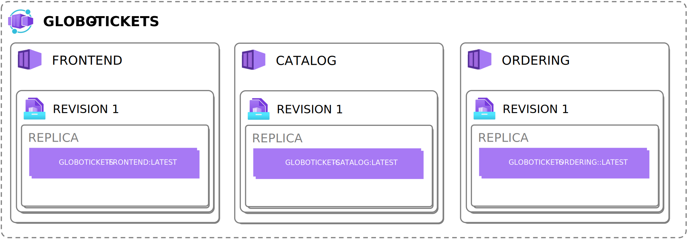
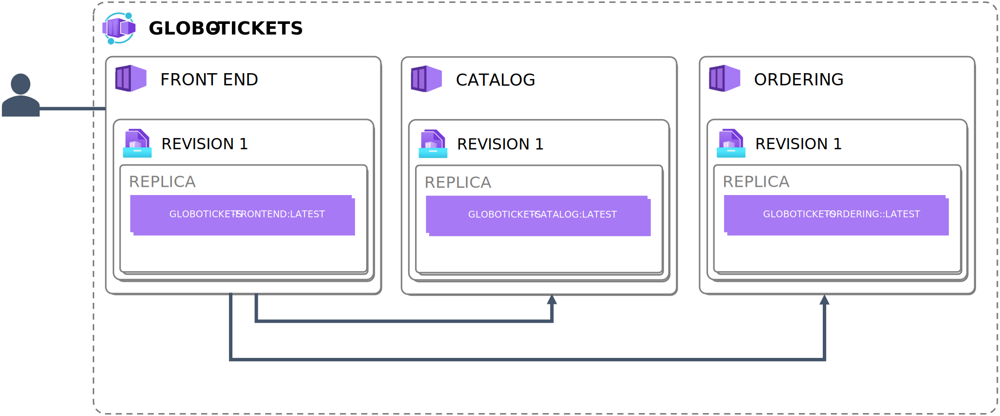

# Lab 2: Deploying an Azure Container App using Infrastructure as code

## 1. Learning about Globo Tickets

### 1.1. Running Globo Tickets Locally
todo docker compose

## 2 Deploying Gobo Tickets

### 2.1 Required infrastructure
todo: describe resources that we're going to create

### 2.2 Deploying Globo Tickets using Azure CLI
todo: cli scripts to deploy infra+containers
### 2.3 Deploying Globo Tickets using Bicep
todo: bicep files to deploy infra+containers
