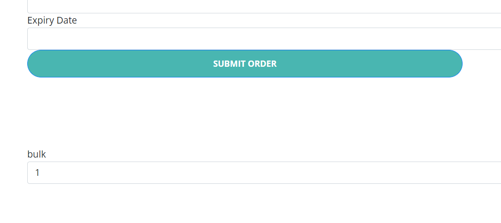

# Lab 7: Dynamic scaling using KEDA


Now we have a working Container App Environment that uses the Azure ServiceBus, it's time to add some autoscaling magic.

## 1. Adding a scaling rule to the Ordering application

This is pretty straightforward:

- Set the min/max replicas to 0/10 for the ordering app
- Add the scaling rule (example below)
- Notice the scaling rule references a secret. Specify that secret exists for the ordering app.

```yaml
{
    name: 'queue-based-autoscaling'
    custom: {
    type: 'azure-servicebus'
    metadata: {
        topicName: 'orders'
        subscriptionName: 'ca-ordering'
        messageCount: '10'
    }
    auth: [
        {
        secretRef: 'servicebusconnectionstring'
        triggerParameter: 'connection'
        }
    ]
    }
}
```

The topic- and subscriptionname combination is of course what will be monitored. The messagecount the number of messages that need to be active in the subscription before scaling starts.

You can tweak the before of message handling quite wel if you combine this with the pubsub component. You can for instance set the 'messageCount' of the KEDA scaler to 1 and 'maxConcurrentHandlers' of the pubsub component to 1 as well.
This will make sure every message is handled by a single instance/replica. If messagehandling isn't fast enough it'll spin up a new replica for each message in the subscription. Be aware of the limitations though (see part 4)!

## 2. Viewing the current number of replicas

Deploy your changes then go to the app. As we don't want any [Taylor Swift Ticketmaster issues](https://www.nbcnews.com/pop-culture/pop-culture-news/taylor-swift-says-watching-ticketmaster-fiasco-excruciating-rcna57897), we added in input field to order many tickets at once. Use this to place your order a 100 times:



View the metrics from the Portal or use the CLI to check the number of replicas. See [Lab 4 - Observability](/labs/observability.md) on how to do this.

## 3. Checking the logs to see what KEDA is doing

If you look at the system logs, you should be able to get some insights into what is happening. See [Lab 4 - Observability](/labs/observability.md) on how to do this.

## 4. Limitations

Before you go all out on scaling, there are a number of things to keep in mind.

- Min/max instances are a target amount, not a guarantee. Not scaling up as far as you expect happens quite often in West Europe. There should be support for your own dedicated resources somewhere on the roadmap.
- The more resources you consume, the more you have to pay. See [billing](https://learn.microsoft.com/en-us/azure/container-apps/billing).
- There are quotas in place:
  - 5 environments per subscription, per region
  - 20 container apps per environment
  - 100 revision per container app
  - 30 replicas per revision
  - 2 cores per replica
  - 20 cores per environment
- The quotas mentioned above [are currently being increased to](https://github.com/microsoft/azure-container-apps/issues/503):
  - 40 cores per environment
  - 40 apps per environment
  - 15 environments per region
- Read all about quotas and how to request an increase in limits [in the docs](https://learn.microsoft.com/en-us/azure/container-apps/quotas). You can request up to 30 environments per region, 100 apps and 100 cores.
- Vertical scaling is not supported.

## 5. Made it to here and still have time and energy?

Some other things to try:

- Create a secretstore and move the secrets to there
- Create user managed identities for your apps
- Create startup/live/ready endpoints (if you create a PR then we can pretty quickly create new Docker images including them) and configure them at the apps
- Recreate the environment in a virtual network and use a private link to an ACR containing the HelloWorld image to test
