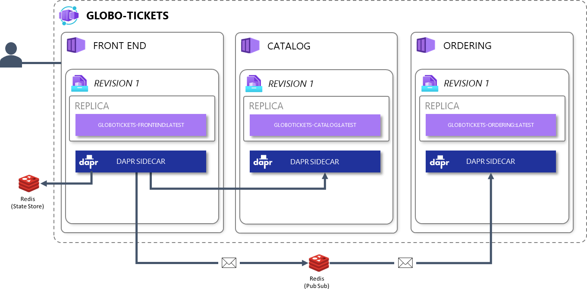
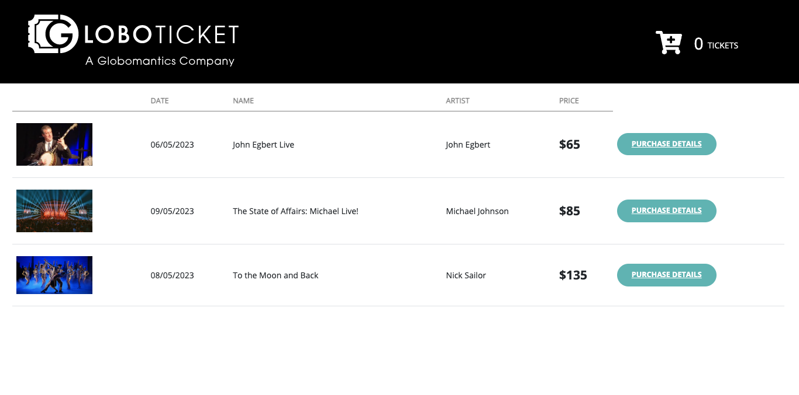

# Lab 5: Adding Dapr to Globo Tickets

The Distributed Application Runtime (Dapr) provides APIs that simplify microservice connectivity. Instead of using the APIs of many different technologies, you are using a single set of generic Dapr APIs and the underlying Dapr components (which is just configuration) take care of the specifics for you. This allows you to run your code locally as well as in the cloud without any changes to your code or conditions in them.

In Globo Tickets, Dapr will be used for:

- Storing state (locally using Redis and in Azure using Cosmos)
- Sending and receiving messages (locally using Redis and in Azure using Service Bus)

When you use Dapr, each of your applications will have a sidecar. Your app will talk to that Dapr sidecar through a set of APIs in the form of a NuGet package.
The sidecar has access to [Dapr components](https://docs.dapr.io/concepts/components-concept/) you configure.


In this lab you'll learn:

- How to install Dapr on your local machine
- Different ways to launch the Dapr sidecar locally
- How to use the Dapr in an application

> Tips:
>
> - If you want, you can start skip this and continue with [Lab 6 - Using Dapr in Azure Container Apps](/labs/using-dapr-aca.md), as that will make use of container images that are provided for you.
> - You are also free to skip the first part and just check out how the code changed or start applying these changes yourself, do whatever you like and we'll help
> - It will not be a complete lab on everything Dapr has to offer, as that is an entire workshop by itself.

## 1. Installing Dapr

First thing you need to do is install the Dapr CLI:

- [Windows](https://docs.dapr.io/getting-started/install-dapr-cli/#tabs-2-windows)
- [Linux](https://docs.dapr.io/getting-started/install-dapr-cli/#tabs-2-linux)

Then make sure to initialize Dapr on your machine. This will spin up some Docker images and create some corresponding Dapr components for you that are used by default if you don't configure your sidecar later on.

- [Initializing Dapr](https://docs.dapr.io/getting-started/install-dapr-selfhost/)

Finally make sure to use the 'src/globo-tickets-dapr' sources for this lab.

## 2. Running an application with the Dapr sidecar locally

There are multiple ways to start the Dapr sidecar together with your application:

1. Manually from the CLI
1. Automatically with a launch profile
1. Automatically by using Docker compose
1. Automatically by writing custom code that launches a process on startup (not included in labs & not recommended)

In the next part we'll work with solution that already has all the Dapr stuff built in and the components are available as well. We'll focus on getting it up and running and go through a few of the changes compared to the non-Dapr solution at the end. Instead of Azure ServiceBus and Azure CosmosDB we'll be using Redis for both storing state and pubsub:



### 2.1 Starting the Dapr sidecar from the CLI

The best way to understand what is going on, is to use a commandline interface and start the Dapr sidecar manually. It's not very user friendly, but that is not the goal here. Execute the following command:

`dapr run --app-id frontend --dapr-http-port 3500 --app-port 5266`

It should tell you that you're up and running and that the sidecar is listening on port 3500 and is waiting until an app is listening on port 5266. If you start the Frontend project it should discover the app (update the port if your app doesn't start at 5266). Try this!

The frontend itself won't work properly, it can't reach the sidecar because it's using the wrong port (defaults to 50001), the other services aren't running and we're still missing some Dapr components. In the next steps we'll fix these problems.

### 2.2 Starting the app together with the sidecar

Stop the app and notice the sidecar doesn't detect this. It also won't work anymore if you then start the app again. You need to stop the sidecar and start it again, which is annoying when developing an application. If you want you can start and stop an application together with the Dapr sidecar like this:

`dapr run --app-id frontend --dapr-http-port 3500 --app-port 5266 -- dotnet run`

When executed from the directory containing the csproj, this will also start the frontend. This time the application does know on which port the sidecar started and you should get a different exception, something with 'state store shopstate is not found'. Lets fix that one too.

### 2.3 Loading the right components

`dapr run --app-id frontend --dapr-http-port 3500 --app-port 5266 --components-path "..\components\docker-compose" -- dotnet run`

What this does, is configure the Dapr sidecar to not load components from the [default directory](https://docs.dapr.io/getting-started/install-dapr-selfhost/#step-5-verify-components-directory-has-been-initialized) but from our own directory. Have a look inside that directory and examine the 'statestore.yaml', compare it to the default 'statestore.yaml' that was loaded by the previous commands.

### 2.4 Accessing the other services

The last exception should be an Internal Server Error in the HttpClientExtension class, because the Dapr sidecar can't reach the Catalog service. Open up a new terminal and run the following command from the Catalog directory. Notice the different Dapr HTTP port (each app has its own sidecar) and of course different app port.

`dapr run --app-id catalog --dapr-http-port 3501 --app-port 5016 --components-path "..\components\docker-compose" -- dotnet run`

Reload the frontend and it should give you a list of concerts. You can't order anything because the Ordering service isn't running. You get the idea, you could repeat the previous step but we'll show you how to do this the easy way further on.

By starting your app like this, if you want to debug, you need to attach a debugger manually which quickly becomes really annoying. Also the starting/stopping of sidecars is a pain, so we don't recommend working like this.

### 2.5 Some alternatives

Of course you can combine the things you just learned with some extensions and features of your IDE and make life a lot easier, but the easiest way to spin up multiple applications is by using Docker compose. The next bit is just for your information, continue with the 'Using Docker compose' part next.

In Visual Studio you can make use of launch profiles in combination with the [Child Process Debugging PowerTool extension](https://marketplace.visualstudio.com/items?itemName=vsdbgplat.MicrosoftChildProcessDebuggingPowerTool) to automatically attach the debugger.

```yaml
"Dapr": {
      "commandName": "Executable",
      "environmentVariables": {
        "ASPNETCORE_ENVIRONMENT": "Development"
      },
      "workingDirectory": "$(ProjectDir)",
      "executablePath": "dapr",
      "commandLineArgs": "run --app-id frontend --dapr-http-port 3500 --app-port 5266 --components-path ..\\components\\docker-compose -- dotnet run"
}
```

In Visual Studio Code you can make use of the Dapr extension and [launch configurations](https://docs.dapr.io/developing-applications/ides/vscode/vscode-how-to-debug-multiple-dapr-apps/)

## 3. Using Docker compose

The easiest way to spin up multiple apps with their sidecar with the press of a button is by using Docker compose. Have a look at the docker-compose.yml and docker-compose.override.yml files.
You'll notice the same parameters as before:

```yaml
services:
  frontend:
    image: ${DOCKER_REGISTRY-}frontend
    build:
      context: .
      dockerfile: frontend/Dockerfile
    networks:
      - globoticket
  frontend-dapr:
    container_name: "frontend-sidecar"
    image: "daprio/daprd:1.8.4"
    command: [
      "./daprd",
     "-app-id", "frontend",
     "-app-port", "80",
     "-components-path", "/components"
     ]
    volumes:
      - "./components/docker-compose/:/components"
    depends_on:
      - frontend
    network_mode: "service:frontend"
```

```yaml
services:
  frontend:
    ports:
      - 5002:80
      - 5001:443 #Kestrel isn't listening to 443 so this one wont work
    environment:
      - ASPNETCORE_ENVIRONMENT=Development
      - ASPNETCORE_URLS=http://+:80
      - ApiConfigs__ConcertCatalog__Uri=http://catalog
      - ApiConfigs__Ordering__Uri=http://ordering
```

There is one thing that you need to change to get the docker-compose project to work. The hostname for both the pubsub and statestore components needs to be updated from 'localhost' to 'redis'. This has to do with the networking of Docker. Do this now and then just start the Docker compose project. The entire Globo Tickets app should work, including ordering. You can debug too. Access the application over HTTP, as Kestrel is only listening on port 80 which is mapped to 5002: [http://localhost:5002/](http://localhost:5002/)

Of course you can also use the CLI to do this if you want. If you try this first and then decide to continue with Visual Studio, run a 'docker container prune' if you get conflicts when starting the Docker Compose project.



## 4. Using the Dapr SDK

Now you have seen the Dapr sidecar do its magic, lets have a look at the changes in the code.

The way to interact with the Dapr sidecar is by using code from the [Dapr.AspNetCore NuGet package](https://www.nuget.org/packages/Dapr.AspNetCore). The most important class is [Dapr.Client.DaprClient](https://docs.dapr.io/developing-applications/sdks/dotnet/dotnet-client/dotnet-daprclient-usage/). This is used for service to service calls, dealing with state, sending messages and more. Another important one for this application is [Dapr.TopicAttribute](https://docs.dapr.io/developing-applications/building-blocks/pubsub/subscription-methods/#tabs-4-net), which tells the Dapr sidecar which topic to subscribe to and which HTTP endpoint should be called when a message arrives.

Have a look at the `Program.cs` of the frontend project in both the `/src/globo-tickets-basic/frontend` and `/src/globo-tickets-dapr/frontend` folders. You'll notice the same interfaces being used, just a different implementation. Have a look at both implementations and see how the DaprClient is being used. Do the same for the `/ordering` folders. For the ordering project, check out the `OrderController.cs` for an example on how to subscribe to a topic.

If you want to code at this point, feel free to take the `globo-tickets-basic` solution and start adding Dapr support to the code. This isn't required for the next lab, as we'll provide Docker images for you. We'll deploy the exact same codebase, but just have different Dapr components which will point to Azure ServiceBus en Azure CosmosDB.
